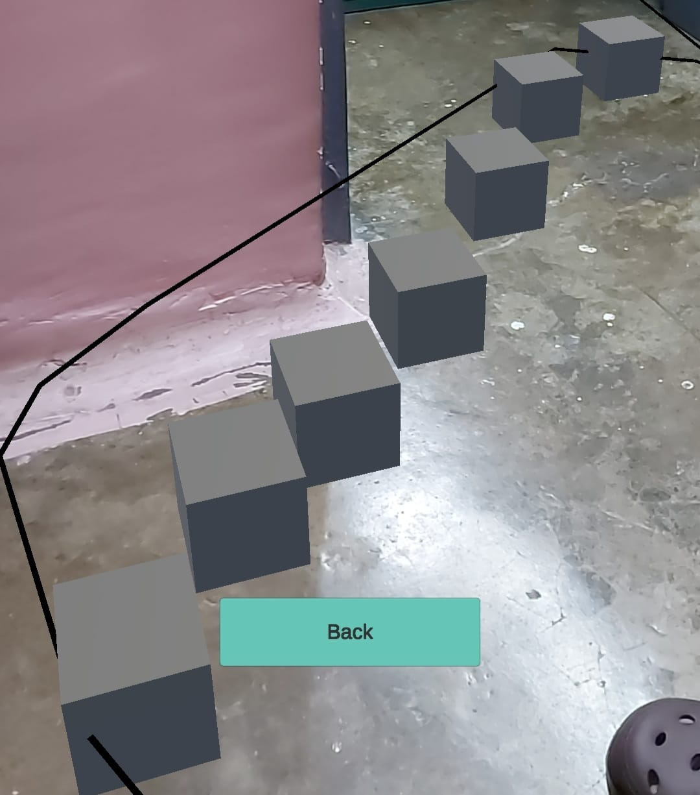

# CareAR

CareAR is a simple, easy to use, elegant AR app built using **Unity** :heart: and **ARCore** :camera: which allows users to connect with an expert in case of any medical emergency and act based on their instructions in order to save the patient's life.

## Backdrop

- More often then not, people fail to get immediate medical assistance which leads to complications that could have been prevented if they could have been helped by an professional at the very beginning. In modern world scenario, "Medical assistance delayed is medical assistance denied!".
- People around the globe have to suffer because of the lack of available specialized medical practitioners and the disproportionate distribution of them in geographical regions.
- Lack of real time knowledge sharing channels, mainly in the healthcare domain, prevents the expertise of experienced professionals from being shared amongst junior doctors and thus, knowledge gained through years of turmoil go in vain without being passed to the future generations.
- In this post COVID world, people struggle to find guided path inside, or even towards a medical facility and thus, lose on precious time while trying to figure out their route. 

## Core Idea

- Build an AR enabled app that allows AR Collab - Annotate and engage with user's environment.
- Allow the remote user to annotate and refect the same on user's screen.
- Add navigation feature so that the user can utilize it for Indoor/Outdoor navigation during Covid times.

## Features

- [x] AR Collab - 3D Annotation
- [x] WiFi enabled interaction 
- [x] Navigation Path Creation
- [x] Guided Navigation
- [ ] ~~Fully Remote Connect Feature~~
- [ ] ~~Different Annotation Objects~~

## Screenshots

  

## Future Scope

- CareAR app, once perfected, can be made available on AppStore/PlayStore.
- CareAR app can be used within care delivery organizations which are a part of UHG to facilitate patients with AR enabled remote assistance 24*7.

## Learnings

- Building AR App using Unity3D
- Handling Unity Packages
- Defining custom materials within Unity
- Using SCRCPY for remote Android to PC connection
- Teamwork and Food are basis of one's survival on earth!
- Unity3D can crash systems, anytime!! ;)

## Contact Us
We're a bunch of enthusiastic geeks who would love to know, learn and grow!! Feel feel to connect with us and share your insights, suggestions and enhancement ideas!!
